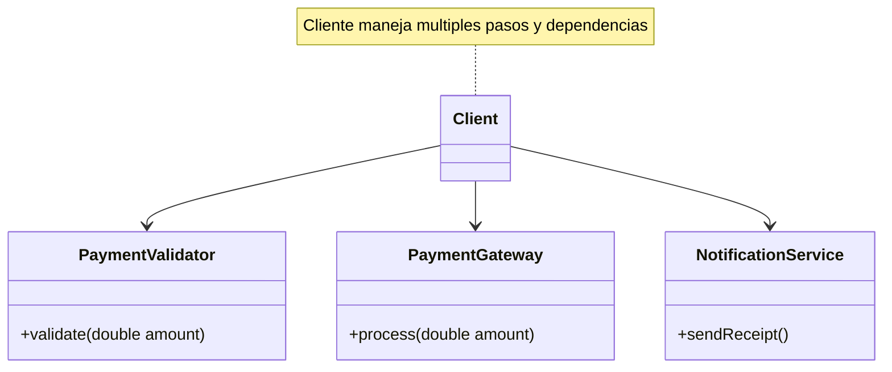
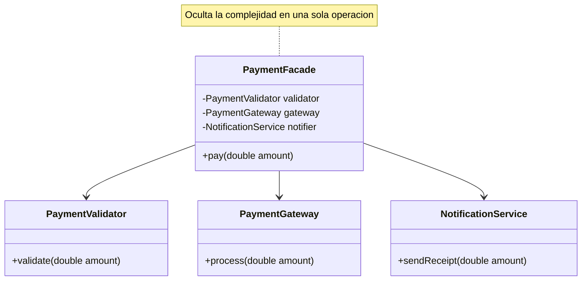
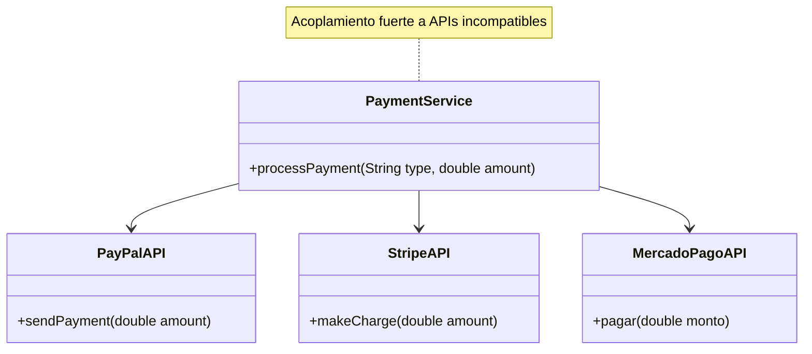
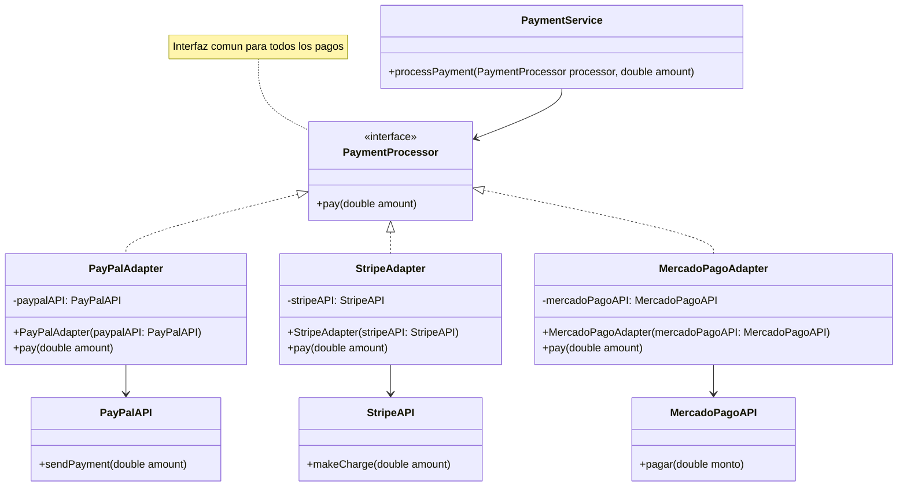
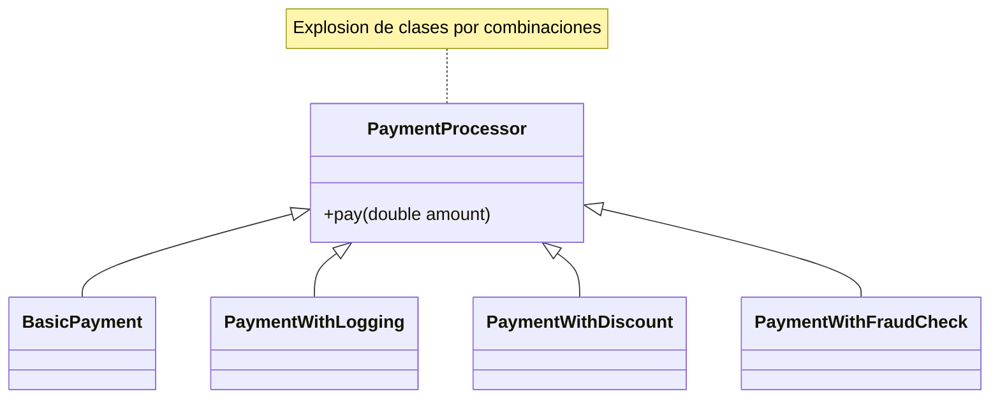
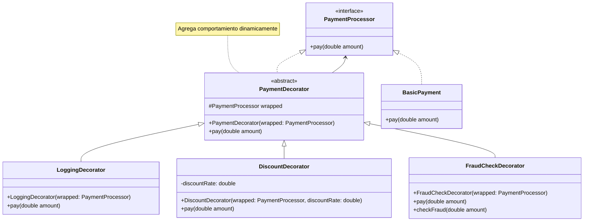

# Laboratorio 04: Patrones Estructurales

- Curso: Ingeniería de Software II  
- Aula: 856  
- Fecha: 05/05/2026  
- Jefe de prácticas: Aron Lo

---

## Caso de Estudio: Sistema de Pagos Extensible

Una empresa de e-commerce necesita implementar un sistema de pagos flexible que permita integrar múltiples proveedores externos y agregar funcionalidades dinámicas sin modificar el código base.

El sistema debe:

- Integrar diferentes pasarelas de pago (APIs incompatibles)
- Permitir agregar funcionalidades como logging, descuentos y validación antifraude
- Ofrecer una interfaz simple para el cliente

---

## Ejercicio 1: Facade Pattern

### Descripción del Problema

El proceso de pago requiere varios pasos: validar el monto, procesar el pago y enviar una confirmación.  
Actualmente, el cliente debe interactuar directamente con múltiples clases para completar este flujo, lo que genera:

- Mayor complejidad en el cliente  
- Alto acoplamiento con varias clases  
- Código difícil de usar y mantener  

---

### 1) Diagrama del Código Actual (Problemático):



---

### ¿Qué queremos resolver?

Simplificar el uso del sistema encapsulando todo el flujo de pago en una sola operación.

Para ello, se aplicará el patrón Facade, que proporciona una interfaz simple para un sistema complejo.


---
### 2) Diagrama de la Solución (Facade):



---

#### Implementa la solución creando:

- PaymentFacade
- Método pay(double amount)
- Flujo interno:
  1. Validar pago  
  2. Procesar pago  
  3. Enviar confirmación  

---

## Reglas del Sistema

- Si el monto es <= 0 → lanzar error  
- Si el monto > 1000 → mostrar mensaje de revisión adicional  
- Siempre enviar confirmación si el pago es exitoso  

---

## Escenario de Prueba

```java
PaymentFacade facade = new PaymentFacade();

facade.pay(100);
facade.pay(1500);
facade.pay(-10); // error esperado
```

---

## Ejercicio 2: Adapter Pattern

### Descripción del Problema

El sistema de pagos debe integrarse con distintos proveedores (PayPal, Stripe, MercadoPago), pero cada uno tiene una API diferente.  
Actualmente, se usan múltiples if/else para manejar estas diferencias, lo que genera:

- Alto acoplamiento  
- Código difícil de mantener  
- Dificultad para agregar nuevos proveedores  

---

### 1) Diagrama del Código Actual (Problemático):



---

### ¿Qué queremos resolver?

Unificar la forma de procesar pagos mediante una interfaz común, eliminando los if/else y desacoplando el sistema de las APIs externas.

Para ello, se aplicará el patrón Adapter, que permite adaptar interfaces incompatibles a una interfaz estándar.

---

### 2) Diagrama de la Solución (Adapter):



---

#### Implementa la solución creando:

- PaymentProcessor (interface)
- PayPalAdapter, StripeAdapter, MercadoPagoAdapter
- Adaptar cada API externa a la interfaz común

---

## Ejercicio 3: Decorator Pattern

### Descripción del Problema

El sistema de pagos necesita agregar funcionalidades como logging, descuentos y validación antifraude.  
Actualmente, estas combinaciones se implementan creando múltiples clases (por ejemplo: PaymentWithLogging, PaymentWithDiscount, etc.), lo que genera:

- Muchas clases para cada combinación  
- Código difícil de mantener  
- Baja flexibilidad para agregar nuevas funcionalidades  

---

### 1) Diagrama del Código Actual (Problemático):



---

### ¿Qué queremos resolver?

Permitir agregar funcionalidades de manera dinámica sin modificar las clases existentes ni crear múltiples combinaciones.

Para ello, se aplicará el patrón Decorator, que permite extender el comportamiento de un objeto envolviéndolo con otros objetos.

---

### 2) Diagrama de la Solución (Decorator):



---

#### Implementa la solución creando:

- PaymentDecorator (abstracto)
- LoggingDecorator
- DiscountDecorator
- FraudCheckDecorator
- Permitir combinar decoradores dinámicamente