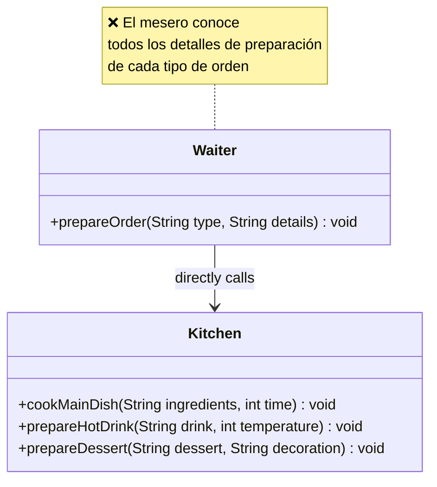
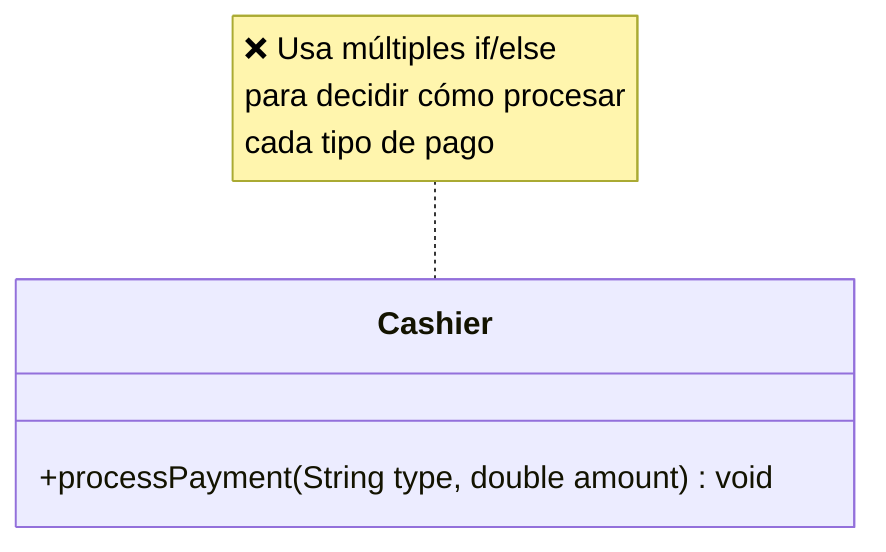

# Laboratorio 05: Patrones de Comportamiento

---

## Caso de Estudio: Sistema de Restaurante “QuickServe”

El restaurante QuickServe necesita modernizar distintos procesos de su operación para reducir errores y mejorar la mantenibilidad del sistema. Actualmente existen problemas en la gestión de órdenes de cocina y en el procesamiento de pagos debido al uso de lógica rígida y poco extensible.

---

## Preparación del Proyecto

1. Crea 2 paquetes:
    - `ejercicio01` - Command
    - `ejercicio02` - Strategy

---

# Ejercicio 1: Command Pattern

**Problema:**
El `Waiter` está fuertemente acoplado a la `Kitchen`. Conoce todos los detalles de preparación (ingredientes, tiempos) y decide qué método usar, violando el Principio de Responsabilidad Única (SRP).

**Solución:**
Aplicar el patrón **Command** para desacoplar ambos. Encapsular cada orden en un objeto independiente (Comando) para que el mesero solo las ejecute sin conocer sus detalles.

### 1) Diagrama del Código Actual (Problemático):

#### **Pistas: implementa la solución creando:**

- `Command` (interface) con el método `execute()`.
- `MainDishCommand`, `HotDrinkCommand` y `DessertCommand`.
- `Kitchen` como receptor de las acciones.
- `Waiter` como invocador que ejecuta comandos.

---

# Ejercicio 2: Strategy Pattern

**Problema:**
La clase `Cashier` centraliza la lógica de los distintos métodos de pago mediante múltiples `if/else`. Esto viola el Principio de Abierto/Cerrado (OCP), ya que agregar un nuevo método obliga a modificar esta clase.

**Solución:**
Aplicar el patrón **Strategy** para extraer cada método de pago en una clase independiente. Así, el procesador puede cambiar la estrategia dinámicamente sin alterar su propio código.

### 1) Diagrama del Código Actual (Problemático):

#### **Pistas: implementa la solución creando:**

- `PaymentStrategy` (interface) con el método `pay(double amount)`.
- `CashPayment`, `CardPayment` y `MobilePayment`.
- `PaymentProcessor` que permita cambiar estrategias dinámicamente.
- Un cliente (`main`) que procese pagos usando diferentes estrategias.

---

## Entregables

Para cada ejercicio, presente:

1. Diagrama de clases UML con las relaciones correspondientes.
2. Implementación en Java de las clases principales.
3. Un ejemplo de uso (`main`) que demuestre el funcionamiento.

---

_Enfócate en entender por qué el código inicial es problemático antes de implementar la solución._